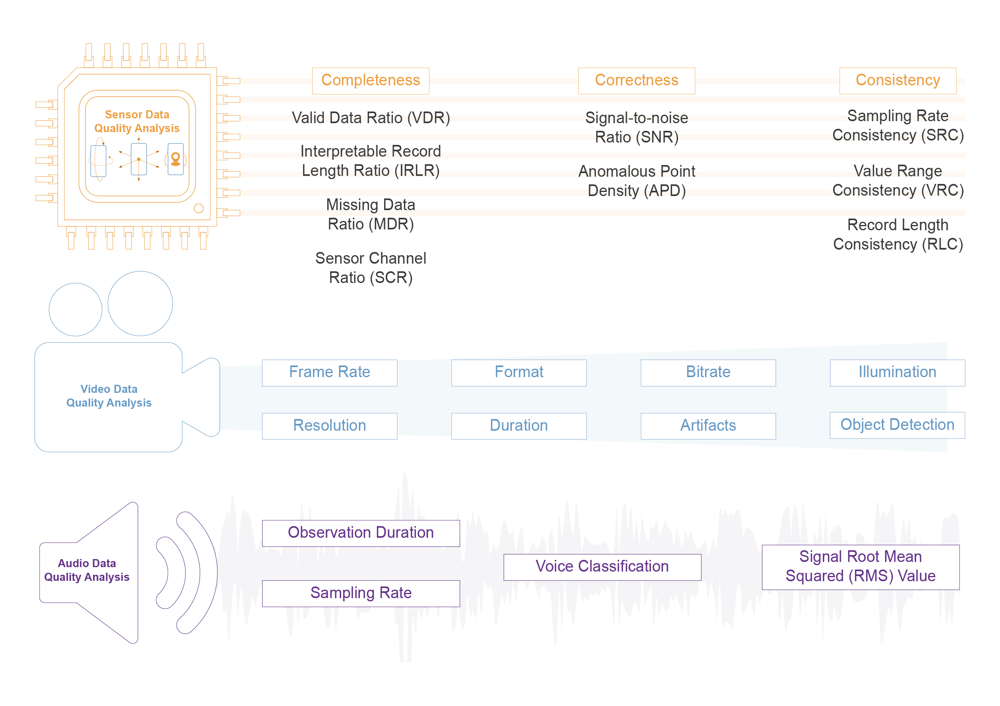

# Summary

With the growing ubiquity of smartphones and wearables there is growing interest in using connected devices embedded with multimodal sensing for health research.  However, gathering sensor data at scale in real world settings through a growing ecosystem of smart devices can lead to variability in data collection. There could be intra- and inter- device differences in data collected from a wide range of device types and models e.g. Android, iOS, along with multiple sources of variability across data acquisition and management e.g. device/sensor configuration, environment.

In order to develop robust disease phenotypes and digital endpoints there is an urgent need  for  assessment of sensor data quality, collected from large populations in real-world settings. We developed the QPrism Python package to serve as a quality assessment toolbox for data collected using sensors in smartphones and wearables (eg. accelerometer, gyroscope, audio and video). The package leverages digital signal and image processing techniques along with machine learning algorithms to assess the quality of sensor data covering data availability, interpretability, noise contamination and consistency. QPrism is completely data-driven, requiring no a priori data assumptions or application-specific parameter tuning to generate a comprehensive data quality report.

# Statement of need

In 2022, the number of smartphone users reached 6.6 billion, and is projected to reach 7.3 billion in 2025 (@statistaSmartphone). In addition, the adoption of wearable devices doubled from 325 million in 2016 to 722 million in 2019, and is projected to exceed 1 billion by the end of 2022 (@statistaWearable). With the increasingly high penetration of consumer focused smart devices, there has been growing interest to assess the feasibility of using such devices to better understand variations in individual-level lifestyles and its impact on health outcomes. However the individual level device/sensor data gathered in real-world settings may be impacted by several sources of variability - from data acquisition (e.g. device/sensor configuration, environment, meta-data), to data management (e.g. missing data, device/sensor malfunction, sampling irregularity) (@Roussos).

Prior to using the data for health research, there is an urgent need for a comprehensive data-driven quality assessment on multimodal real-world digital health data across  multiple dimensions -  completeness, correctness, consistency. Data completeness assesses the level of valid data availability, while correctness assesses the data format and value integrity, and consistency evaluates representational and value uniformity.  

QPrism fills the current gap by allowing researchers and developers to perform data-driven, multimodal, and multi-dimensional data quality assessment. QPrism provides up to 21 robust multimodal sensor data quality metrics (DQM) in a single package for comprehensive data-driven quality assessment of real-word sensor data. These DQMs are quality descriptors for smartphone and wearable sensor data, allowing quantitative assessment of sensor data quality, including video and audio data (\autoref{fig:1}).

# Methodology

The DQMs are initially computed at an individual sensor data observation level e.g. accelerometer output, video recording, or image, up to a multimodal database level. The users may also select input data of different sizes, as well as selecting the application-specific DQMs of interest. Upon DQM computation, QPrism aggregates and reports the summary level results in a .csv file format. The full list of DQMs and descriptions are provided in the [glossary](https://qprism.readthedocs.io/en/latest/glossary.html), and their mathematical formulae are provided in the [implementation](https://qprism.readthedocs.io/en/latest/inplementation.html).

## Sensor Data Quality

The Sensor submodule evaluates the quality of sensor data across three dimensions: correctness, completeness, and consistency via computation of nine data quality metrics. 

Four completeness DQMs are provided to assess the level of data availability i.e. completeness. First, the level of data validity is computed as the valid data ratio (VDR) such that ‘nan’ data points are regarded as invalid. Second, the interpretable record length ratio (IRLR) assesses the ratio of sensor data observations represented in less than two data points. Invalid and uninterpretable data is excluded from further quality assessment. Second, multichannel sensor data is assessed for the availability of data channels e.g. 3-axis accelerometer via computation of sensor channel ratio (SCR). Lastly, data point missingness is investigated as a manifestation of irregular sensor data sampling via computation of the missing data ratio (MDR), which is majorly affected by inter-sensor and inter-device data sampling protocols, and external and internal data collection factors. 

On the sensor data correctness level, QPrism assesses the noise contamination levels via two correctness DQMs: the signal-to-noise ratio (SNR) and the anomalous point density (APD). First, the SNR is computed as an approximation of noise levels in sensor data observation rather than an accurate calculation since separate noise recordings are unavailable. Second, the APD is computed via Feature Bagging (@Lazarevic) followed by decision score thresholding (@Yang), indicating the ratio of anomalies in sensor data observations.

And lastly, on the data consistency side, QPrism provides three consistency metrics to assess the level of uniformity and regularity of data: sampling rate consistency (SRC), record length consistency (RLC), and value range consistency (VRC). First, SRC assesses the uniformity of data sampling according to a data-driven sampling rate requiring no prior input or parameter tuning. However, RLC and VRC require multiple records to assess the level of data length and dynamic range uniformity between records, respectively. 

The sensor submodule accepts structured time series data inputs having timestamps as the first column and record data as the rest of the columns. 

## Video Data Quality

QPrism has a separate submodule to assess the quality of video data using nine DQMs (\autoref{fig:1}). The video DQMs range from : total video length, resolution, format, bit rate, detected objects, frame rate, creation date, to illumination and assessment of artifact proportion. To quantify some of the video DQMs, QPrism integrates open-source packages (@Bradski)(@moviepy). Video DQMs provide the main properties of a single or multiple video recordings, to be further interpreted by the user according to their application interest and intended use e.g length, frame rate. Some of the advanced DQMs such as the detected objects use machine vision concepts to investigate the content of the video(s) with respect to the intended use. The percentage of distortion present in the video can be calculated using the “check_artifacts'' function. This submodule also supports a YOLOv5 (@yolov5) model pre-trained on the COCO dataset for video object detection and list generation. The video data submodule accepts video data in mp4 format.

## Audio Data Quality

The audio data submodule in QPrism includes four audio data quality metrics, including two data preprocessing/conversion helper functions. This submodule makes use of a set of open-source libraries such as Librosa (@McFee), Scipy (@Virtanen), Audioop, MoviePy, and Pydub. Standard audio data descriptors include data length, root mean squared (RMS) value, and sampling rate. The RMS value indicates the level or volume of the audio signal, which reflects a level of interpretability of audio data when extremely low. These descriptors are to be built upon by the user to be transformed into application-specific DQMs. QPrism also performs deep learning-based classification of present sounds in the input audio file(s) via transfer learning from the YAMNet model (@YAMNet). Additionally, to make use of QPrism’s sensor data DQMs that are fully compatible with audio data, we provided a function to convert audio files into acceptable sensor submodule input data i.e. structured data frames that can be used to generate the nine sensor DQMs described above. The audio submodule  accepts audio data in mp3 and wav formats.

# Acknowledgements

The development of QPrism package is supported by Krembil Foundation.

The authors also like to acknowledge Aditi Surendra for designing the module function illustration.

# References